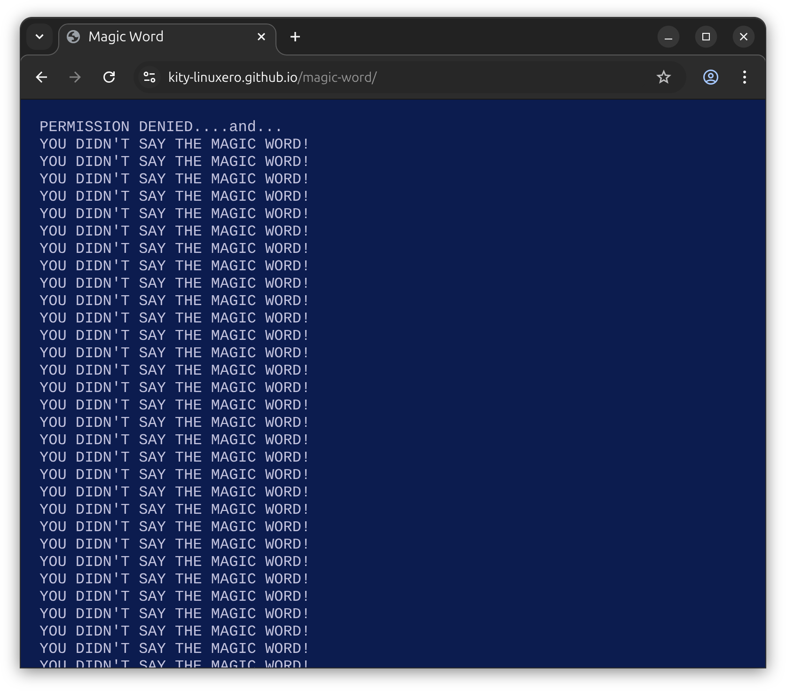
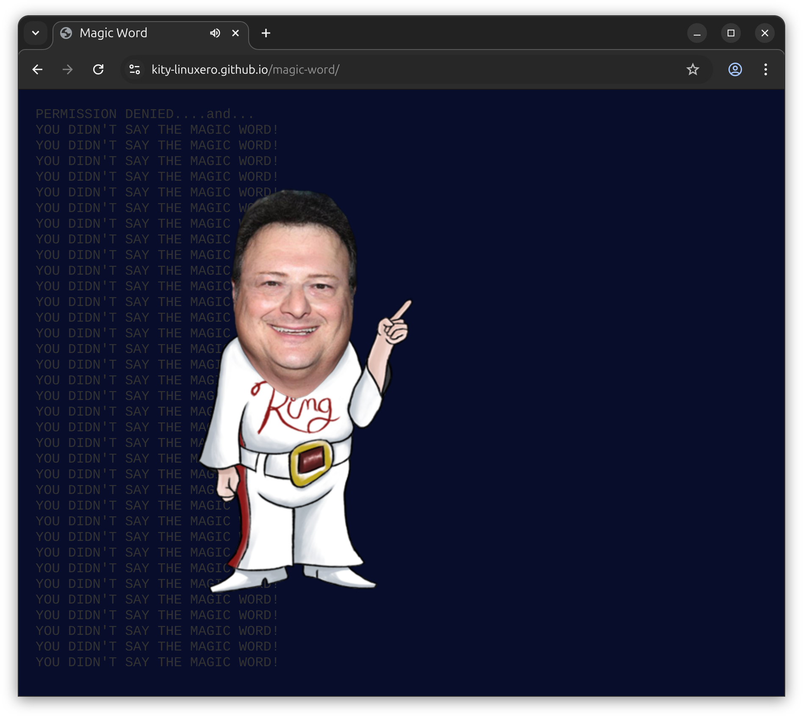

# magic-word

Magic Word is a simple page that can be used to indicate denied access, inspired by the phrase "YOU DIDN'T SAY THE MAGIC WORD" from the movie Jurassic Park, one of my favorites when I was a kid.

I relied on the repo [https://github.com/MarkHjorth/nedry](https://github.com/MarkHjorth/nedry) to display the Nedry animation (credits to [MarkHjorth](https://github.com/MarkHjorth)), adding the screen that shows the terminal text.

### Screenshot

### Demo online

Try this in [demo online](https://kity-linuxero.github.io/magic-word/)